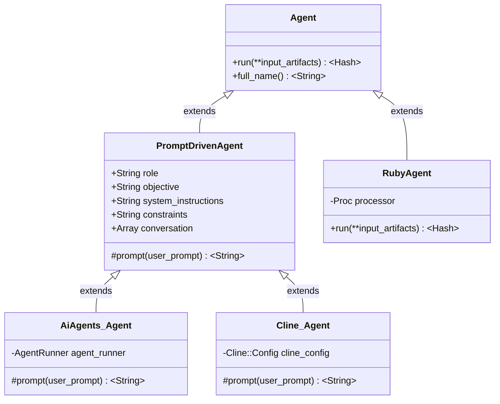
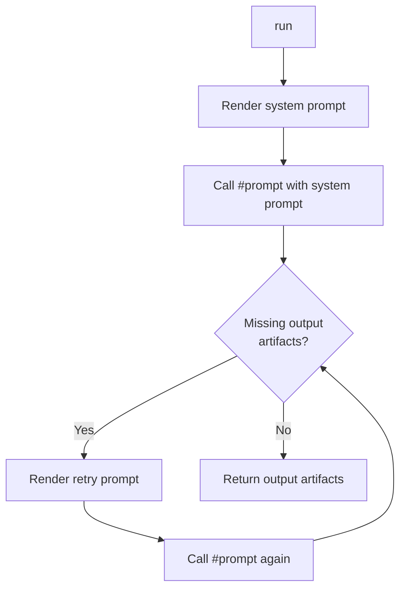
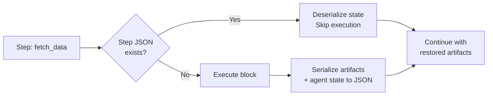

<div align="center">

# composable_agents

A Ruby framework for building **composable, prompt-driven AI agent pipelines** — mix, match, and orchestrate agents into reusable workflows.

[](https://github.com/Muriel-Salvan/composable_agents/actions/workflows/continuous_integration.yml)
[](https://codecov.io/gh/Muriel-Salvan/composable_agents)
[](https://github.com/Muriel-Salvan/composable_agents/stargazers)
[](LICENSE)
[](https://rubygems.org/gems/composable_agents)
[](https://rubygems.org/gems/composable_agents)

</div>

**composable_agents** is a Ruby gem that lets you build modular AI agent pipelines 🧩 — compose simple agents together into complex, resumable workflows.

Think of it as **LEGO® for AI agents**: each agent is a self-contained unit that takes input artifacts, processes them (via an LLM, custom Ruby code, or a sub-agent), and produces output artifacts. You can:

- 🧠 **Create prompt-driven agents** with role, objective, instructions, and constraints
- 🔄 **Chain agents together** so the output of one becomes the input of another
- 📦 **Define typed artifact contracts** with validation for inputs/outputs
- 💾 **Resume interrupted runs** — long workflows keep their state between executions
- 🗣️ **Let agents ask users questions** when they need clarification
- 🎯 **Integrate with multiple LLM backends** via [cline-rb](https://github.com/Muriel-Salvan/cline-rb) or [ai-agents](https://github.com/nicbarker/ai-agents)
- 📝 **Use flexible prompt rendering** (Markdown, or heavy Markdown with structured outputs)

Whether you're building a code review assistant, a document summarizer, or a multi-step research pipeline, composable_agents gives you the building blocks to design, test, and run AI agent systems — all from Ruby.

## Table of contents

- [Quick start](#quick-start)
  - [Installation](#installation)
  - [Basic usage: create a composed pipeline of agents](#basic-usage-create-a-composed-pipeline-of-agents)
  - [Using the Cline backend instead](#using-the-cline-backend-instead)
  - [Next steps](#next-steps)
- [Requirements](#requirements)
- [Features](#features)
- [Public API](#public-api)
  - [Module constant](#module-constant)
    - [`ComposableAgents::VERSION`](#composableagentsversion)
  - [Core agent classes](#core-agent-classes)
    - [`ComposableAgents::Agent`](#composableagentsagent)
    - [`ComposableAgents::RubyAgent < Agent`](#composableagentsrubyagent--agent)
    - [`ComposableAgents::Instructions`](#composableagentsinstructions)
    - [`ComposableAgents::PromptDrivenAgent < Agent`](#composableagentspromptdrivenagent--agent)
  - [LLM backend agent classes](#llm-backend-agent-classes)
    - [`ComposableAgents::AiAgents::Agent < PromptDrivenAgent`](#composableagentsaiagentsagent--promptdrivenagent)
    - [`ComposableAgents::Cline::Agent < PromptDrivenAgent`](#composableagentsclineagent--promptdrivenagent)
    - [`ComposableAgents::Cline::MissingSkillError < RuntimeError`](#composableagentsclinemissingskillerror--runtimeerror)
  - [Mixins](#mixins)
    - [`ComposableAgents::Mixins::Logger`](#composableagentsmixinslogger)
    - [`ComposableAgents::Mixins::Resumable`](#composableagentsmixinsresumable)
    - [`ComposableAgents::Mixins::UserInteraction`](#composableagentsmixinsuserinteraction)
    - [`ComposableAgents::Mixins::ArtifactContract`](#composableagentsmixinsartifactcontract)
  - [Additional notes](#additional-notes)
- [Documentation](#documentation)
- [How it works](#how-it-works)
  - [Architecture overview 🏗️](#architecture-overview-)
  - [Composition: the pipeline pattern 🔄](#composition-the-pipeline-pattern-)
  - [Prompt-driven execution flow 🧠](#prompt-driven-execution-flow-)
  - [Prompt rendering strategies 📝](#prompt-rendering-strategies-)
  - [LLM backends: ai-agents vs cline-rb 🎯](#llm-backends-ai-agents-vs-cline-rb-)
  - [Mixin system — augment agents with capabilities 🧰](#mixin-system--augment-agents-with-capabilities-)
  - [Instruction system 📋](#instruction-system-)
  - [Code loading ⚡](#code-loading-)
  - [State persistence for resumable workflows 💾](#state-persistence-for-resumable-workflows-)
- [Development](#development)
  - [Prerequisites](#prerequisites)
  - [Clone the repository](#clone-the-repository)
  - [Install dependencies](#install-dependencies)
  - [Project structure (high-level)](#project-structure-high-level)
  - [Run tests](#run-tests)
    - [Test debugging](#test-debugging)
    - [Code coverage](#code-coverage)
  - [Code linting](#code-linting)
  - [Generate documentation](#generate-documentation)
  - [Package the gem](#package-the-gem)
  - [Common development tasks](#common-development-tasks)
    - [Adding a new feature](#adding-a-new-feature)
    - [Adding a test helper](#adding-a-test-helper)
    - [Running examples](#running-examples)
    - [CI pipeline](#ci-pipeline)
    - [Release process](#release-process)
- [Contributing](#contributing)
  - [🐛 Issues](#-issues)
  - [🍴 Fork & Branch](#-fork--branch)
  - [🧪 Setting up test dependencies & running tests](#-setting-up-test-dependencies--running-tests)
  - [✅ Linting & code style](#-linting--code-style)
  - [🔁 CI / Build pipeline](#-ci--build-pipeline)
  - [📝 Pull request guidelines](#-pull-request-guidelines)
  - [📄 License](#-license)
- [License](#license)

## Quick start

### Installation

Add the gem to your application's Gemfile:

```bash
bundle add composable_agents
```

Or install it globally:

```bash
gem install composable_agents
```

Requires **Ruby >= 3.1**.

### Basic usage: create a composed pipeline of agents

Here's a minimal example that chains three agents together to build a holiday planner.

```ruby
require 'composable_agents'

# --- 1. Define the agents ---

# An LLM-powered agent (uses ai-agents gem, needs an API key)
class ItineraryAgent < ComposableAgents::AiAgents::Agent
  def initialize
    super(
      role: 'You are a travel planner',
      objective: 'Find cities matching the user preferences',
      system_instructions: <<~EO_INSTRUCTIONS,
        Get the user preferences from the artifact named `preferences`.
        Find the best cities.
        Create an artifact named `cities` as a JSON list of city names.
      EO_INSTRUCTIONS
      model: 'openai/gpt-4o-mini'   # or any model supported by your provider
    )
  end
end

# A plain Ruby agent (no LLM needed)
class BudgetAgent < ComposableAgents::RubyAgent
  def initialize
    super(proc do |input_artifacts|
      cities = JSON.parse(input_artifacts[:cities])
      { budget: cities.size * 1000 }
    end)
  end
end

# --- 2. Configure the LLM provider (for ai-agents backend) ---
require 'agents'
Agents.configure do |config|
  config.openrouter_api_key = ENV.fetch('OPENROUTER_API_KEY', nil)
end

# --- 3. Compose and run them ---
preferences = { preferences: 'Cultural city trips in Europe' }

itinerary_outputs = ItineraryAgent.new.run(**preferences)
budget_outputs     = BudgetAgent.new.run(**itinerary_outputs)

puts "Cities: #{itinerary_outputs[:cities]}"
puts "Budget: $#{budget_outputs[:budget]}"
```

### Using the Cline backend instead

If you prefer the `cline-rb` backend, set the `CLINE_API_KEY` environment variable:

```ruby
# Use Cline-powered agents instead
itinerary_agent = ComposableAgents::Cline::Agent.new(
  role: 'You are a travel planner',
  objective: 'Find cities matching the user preferences',
  model: 'anthropic/claude-sonnet-4.6',
  api_key: ENV.fetch('CLINE_API_KEY', nil),
  input_artifacts_contracts:  { preferences: 'User travel preferences' },
  output_artifacts_contracts: { cities: 'List of best cities' }
)
```

### Next steps

- Browse the [examples/](https://github.com/Muriel-Salvan/composable_agents/tree/main/examples) directory for full working scripts.
- Use the `ArtifactContract` mixin to validate inputs/outputs.
- Use the `Resumable` mixin to persist and resume long-running workflows.
- Use the `AiAgentUserInteraction` mixin to let agents ask the user questions.

## Requirements

- **Ruby** >= 3.1 — The gem requires Ruby 3.1 or newer.
- **Bundler** — Used to install the gem and manage its dependencies (comes with Ruby).
- **Node.js** — Required at runtime by the `cline-rb` backend for pseudo-terminal (PTY) support via `node-pty`.
- **An LLM provider API key** — One of the following (depending on the agent backend you use):
  - **OpenRouter API key** — Set via the `OPENROUTER_API_KEY` environment variable when using the `AiAgents` backend.
  - **Cline API key** — Set via the `CLINE_API_KEY` environment variable when using the `Cline` backend.

## Features

**composable_agents** is a Ruby framework for building **modular, prompt-driven AI agent pipelines** 🧩. Here are its key capabilities:

- 🧠 **Three agent types** — Create LLM-powered agents via [`PromptDrivenAgent`](lib/composable_agents/prompt_driven_agent.rb), wrap plain Ruby logic with [`RubyAgent`](lib/composable_agents/ruby_agent.rb), or compose complex multi-step workflows using the [`Resumable`](lib/composable_agents/mixins/resumable.rb) mixin.
- 🔄 **Composable pipelines** — Pass output artifacts from one agent directly as input to another, forming reusable, chainable workflows.
- 🎯 **Multiple LLM backends** — Plug into different AI providers via the [`ai-agents`](https://github.com/nicbarker/ai-agents) gem (OpenRouter) or [`cline-rb`](https://github.com/Muriel-Salvan/cline-rb) (Claude, GPT, and many more).
- 📝 **Two prompt rendering strategies** — Choose between clean **Markdown** for simple agents, or **MarkdownHeavy** with structured output parsing, execution checklists, and typed artifact support for complex agentic systems.
- 📦 **Typed artifact contracts** — Define and validate input/output schemas with descriptions, optional flags, and types (`:text`, `:markdown`, `:json`). The framework raises clear `MissingInputArtifactError`, `MissingOutputArtifactError`, or `ArtifactTypeError` on violations.
- 💾 **Resumable execution** — Persist step-by-step state to disk (via the `Resumable` mixin). Interrupted runs can be resumed seamlessly — previously completed steps are skipped, saving time and API costs.
- 🗣️ **User interaction** — Agents can ask users clarifying questions mid-execution. Works out of the box via the terminal, or through an `ai-agents` tool integration for LLM-controlled workflows.
- 📋 **Automatic conversation tracking** — Every prompt and response is automatically recorded with timestamps in a structured `conversation` store, ready for debugging or replay.
- ⚙️ **Flexible instruction system** — Use raw text, structured ordered-lists, or a mix of both to define agent instructions, rendered consistently by the chosen strategy.
- 🛠️ **Cline skill support** — Select and enable specific Cline skills per agent, with automatic dependency resolution.
- 🔐 **State export/import** — Agents can serialize and restore their internal state via `export_state`/`import_state`, enabling deep integration with the resumable workflow system.
- 🐛 **Debug logging** — Toggle verbose debug output with the `COMPOSABLE_AGENTS_DEBUG=1` environment variable.
- 📐 **Markdown header alignment** — A built-in utility normalizes Markdown header levels across composed prompts, maintaining a clean document hierarchy.

## Public API

This section documents all public entry points of the **composable_agents** gem.
The project is a Ruby library (not a CLI) — users install the gem and use its classes and mixins in their own Ruby code.

---

### Module constant

#### `ComposableAgents::VERSION`

- **Description:** The current version of the gem (`'0.1.0'`).
- **Full documentation:** [version.rb on GitHub](https://github.com/Muriel-Salvan/composable_agents/blob/main/lib/composable_agents/version.rb)

---

### Core agent classes

#### `ComposableAgents::Agent`

- **Description:** Abstract base class for all agents. An agent is a computational unit that transforms input artifacts into output artifacts. Agents are stateless by default.
- **Public methods:**
  - `#initialize(name: nil, composable_agents_dir: '.composable_agents')` — Create a new agent with an optional name and a working directory.
  - `#name` — Return the agent's name (`String`, or `nil`).
  - `#full_name` — Return a human-readable full name for logs and traces (can be overridden by subclasses).
- **Usage example:**
  ```ruby
  class MyCustomAgent < ComposableAgents::Agent
    def run(**input_artifacts)
      # Process input_artifacts and return output artifacts
      { result: input_artifacts[:data].upcase }
    end
  end

  agent = MyCustomAgent.new(name: 'uppercaser')
  output = agent.run(data: 'hello')
  puts output[:result]  # => "HELLO"
  ```
- **Full documentation:** [Agent on RubyDoc](https://www.rubydoc.info/gems/composable_agents/ComposableAgents/Agent) | [agent.rb on GitHub](https://github.com/Muriel-Salvan/composable_agents/blob/main/lib/composable_agents/agent.rb)

#### `ComposableAgents::RubyAgent < Agent`

- **Description:** An agent that wraps arbitrary Ruby logic as a `Proc`. No LLM is needed — ideal for deterministic or simple processing steps.
- **Public methods:**
  - `#initialize(processor, *args, **kwargs)` — The `processor` is a `#call`-able object (e.g. a `Proc`) that receives input artifacts and returns output artifacts.
  - `#run(**input_artifacts)` — Execute the proc with the given input artifacts.
- **Usage example:**
  ```ruby
  # A simple agent that doubles a number
  double_agent = ComposableAgents::RubyAgent.new(
    proc { |inputs| { double: inputs[:number] * 2 } }
  )
  result = double_agent.run(number: 21)
  puts result[:double]  # => 42
  ```
- **Full documentation:** [RubyAgent on RubyDoc](https://www.rubydoc.info/gems/composable_agents/ComposableAgents/RubyAgent) | [ruby_agent.rb on GitHub](https://github.com/Muriel-Salvan/composable_agents/blob/main/lib/composable_agents/ruby_agent.rb)

#### `ComposableAgents::Instructions`

- **Description:** Normalizes instructions (system prompts, user prompts) into a canonical list format. Supports plain text strings and structured hashes (e.g. with `ordered_list` keys). Includes `Enumerable`.
- **Public methods:**
  - `#initialize(instructions)` — Accepts a `String`, an `Array`, or a `Hash{text:, ordered_list:}`.
  - `#each(&)` — Iterate over each instruction as `(type, content)` pairs.
- **Usage example:**
  ```ruby
  instructions = ComposableAgents::Instructions.new({
    ordered_list: ['Step one', 'Step two']
  })
  instructions.each do |type, content|
    puts "#{type}: #{content}"
  end
  ```
- **Full documentation:** [Instructions on RubyDoc](https://www.rubydoc.info/gems/composable_agents/ComposableAgents/Instructions) | [instructions.rb on GitHub](https://github.com/Muriel-Salvan/composable_agents/blob/main/lib/composable_agents/instructions.rb)

#### `ComposableAgents::PromptDrivenAgent < Agent`

- **Description:** An agent that uses a **prompt rendering strategy** (Markdown or MarkdownHeavy) to build prompts for an LLM. It manages role, objective, instructions, constraints, and a conversation history.
- **Public methods:**
  - `#role` / `#role=` — Agent's role description.
  - `#objective` / `#objective=` — Agent's objective.
  - `#system_instructions` / `#system_instructions=` — Instructions for the agent.
  - `#constraints` / `#constraints=` — Constraints the agent must respect.
  - `#conversation` — Read the conversation history (array of message hashes).
  - `#initialize(*args, role:, objective:, system_instructions:, constraints:, strategy:, **kwargs)` — The `strategy` defaults to `PromptRenderingStrategy::Markdown`.
  - `#full_name` — Human-readable name for logs.
  - `#run(user_instructions: nil, **input_artifacts)` — Execute the agent and produce output artifacts.
- **Usage example:**
  ```ruby
  agent = ComposableAgents::PromptDrivenAgent.new(
    role: 'A helpful assistant',
    objective: 'Answer user questions'
  )
  # Subclass and implement #prompt(user_prompt) to provide the LLM backend.
  ```
- **Full documentation:** [PromptDrivenAgent on RubyDoc](https://www.rubydoc.info/gems/composable_agents/ComposableAgents/PromptDrivenAgent) | [prompt_driven_agent.rb on GitHub](https://github.com/Muriel-Salvan/composable_agents/blob/main/lib/composable_agents/prompt_driven_agent.rb)

---

### LLM backend agent classes

#### `ComposableAgents::AiAgents::Agent < PromptDrivenAgent`

- **Description:** An agent that uses the [`ai-agents`](https://github.com/nicbarker/ai-agents) gem as its LLM backend. Requires an OpenRouter API key configured via `Agents.configure`.
- **Public methods:**
  - `#initialize(*args, model:, params:, handoff_agents:, **kwargs)` — Specify the `model` (e.g. `'openai/gpt-4o-mini'`), optional `params` for model configuration, and a list of `handoff_agents`.
  - `#full_name` — Returns `"<name> (AiAgent <model>)"`.
- **Usage example:**
  ```ruby
  require 'agents'
  Agents.configure { |c| c.openrouter_api_key = ENV['OPENROUTER_API_KEY'] }

  agent = ComposableAgents::AiAgents::Agent.new(
    role: 'Travel planner',
    objective: 'Suggest destinations',
    system_instructions: 'Create an artifact named `cities` with city names.',
    model: 'openai/gpt-4o-mini'
  )
  result = agent.run(preferences: 'beach holidays')
  puts result[:cities]
  ```
- **Full documentation:** [AiAgents::Agent on RubyDoc](https://www.rubydoc.info/gems/composable_agents/ComposableAgents/AiAgents/Agent) | [ai_agents/agent.rb on GitHub](https://github.com/Muriel-Salvan/composable_agents/blob/main/lib/composable_agents/ai_agents/agent.rb)

#### `ComposableAgents::Cline::Agent < PromptDrivenAgent`

- **Description:** An agent that uses the [`cline-rb`](https://github.com/Muriel-Salvan/cline-rb) gem as its LLM backend. Requires a `CLINE_API_KEY` environment variable. Automatically prepends the `ArtifactContract` mixin.
- **Public methods:**
  - `#initialize(*args, strategy:, provider:, model:, api_key:, configure_provider:, configure_global:, skills:, cli_options:, **kwargs)` — Configure provider, model, optional skill list, and CLI options. Defaults to `'cline'` provider, `'anthropic/claude-sonnet-4.6'` model.
  - `#full_name` — Returns `"<name> (Cline <provider>/<model>)"`.
- **Usage example:**
  ```ruby
  agent = ComposableAgents::Cline::Agent.new(
    role: 'Travel planner',
    objective: 'Suggest destinations',
    model: 'deepseek/deepseek-v4-flash',
    api_key: ENV['CLINE_API_KEY'],
    input_artifacts_contracts:  { preferences: 'User preferences' },
    output_artifacts_contracts: { cities: 'City list' }
  )
  result = agent.run(preferences: 'cultural trips in Italy')
  puts result[:cities]
  ```
- **Full documentation:** [Cline::Agent on RubyDoc](https://www.rubydoc.info/gems/composable_agents/ComposableAgents/Cline/Agent) | [cline/agent.rb on GitHub](https://github.com/Muriel-Salvan/composable_agents/blob/main/lib/composable_agents/cline/agent.rb)

#### `ComposableAgents::Cline::MissingSkillError < RuntimeError`

- **Description:** Raised by `Cline::Agent` when a referenced skill is not found in the global or project Cline configuration.
- **Full documentation:** [cline/agent.rb on GitHub](https://github.com/Muriel-Salvan/composable_agents/blob/main/lib/composable_agents/cline/agent.rb)

---

### Mixins

Mixins are `prepend`-ed into an agent class to add specific capabilities.

#### `ComposableAgents::Mixins::Logger`

- **Description:** Provides debug and info logging to agents. Debug mode is enabled by setting `COMPOSABLE_AGENTS_DEBUG=1` in the environment.
- **Public methods (class-level):**
  - `self.debug?` — Returns `true` if debug mode is enabled (`ENV['COMPOSABLE_AGENTS_DEBUG'] == '1'`).
- **Usage example:**
  ```ruby
  # Enable debug logs
  ENV['COMPOSABLE_AGENTS_DEBUG'] = '1'
  puts ComposableAgents::Mixins::Logger.debug?  # => true
  ```
- **Full documentation:** [Mixins::Logger on RubyDoc](https://www.rubydoc.info/gems/composable_agents/ComposableAgents/Mixins/Logger) | [logger.rb on GitHub](https://github.com/Muriel-Salvan/composable_agents/blob/main/lib/composable_agents/mixins/logger.rb)

#### `ComposableAgents::Mixins::Resumable`

- **Description:** Adds step-level persistence and resumption capabilities to agents. Steps and their artifacts are serialized to JSON on disk so that long-running workflows can be interrupted and resumed.
- **Public methods:**
  - `#initialize(*args, run_id:, **kwargs)` — The `run_id` identifies the persisted run.
- **Usage example:**
  ```ruby
  class WorkflowAgent < ComposableAgents::Agent
    prepend ComposableAgents::Mixins::Resumable

    def run(**inputs)
      @artifacts = inputs
      step(:process_data) { @artifacts[:result] = @artifacts[:data].upcase }
      step(:finalize)     { @artifacts[:done] = true }
      @artifacts
    end
  end

  # If interrupted between steps, re-running with the same run_id skips completed steps
  WorkflowAgent.new(run_id: 'my_workflow').run(data: 'hello')
  ```
- **Full documentation:** [Mixins::Resumable on RubyDoc](https://www.rubydoc.info/gems/composable_agents/ComposableAgents/Mixins/Resumable) | [resumable.rb on GitHub](https://github.com/Muriel-Salvan/composable_agents/blob/main/lib/composable_agents/mixins/resumable.rb)

#### `ComposableAgents::Mixins::UserInteraction`

- **Description:** Adds a simple question-and-answer interface for agents. By default, questions are printed to the terminal and answers are read from `$stdin`. Override `#answer_to` for custom behavior.
- **Public methods:**
  - `#ask(question)` — Ask the user a question and return the answer.
- **Usage example:**
  ```ruby
  class InteractiveAgent < ComposableAgents::Agent
    include ComposableAgents::Mixins::UserInteraction

    def run(**)
      name = ask('What is your name?')
      { greeting: "Hello, #{name}!" }
    end
  end
  ```
- **Full documentation:** [Mixins::UserInteraction on RubyDoc](https://www.rubydoc.info/gems/composable_agents/ComposableAgents/Mixins/UserInteraction) | [user_interaction.rb on GitHub](https://github.com/Muriel-Salvan/composable_agents/blob/main/lib/composable_agents/mixins/user_interaction.rb)

#### `ComposableAgents::Mixins::ArtifactContract`

- **Description:** Validates input and output artifacts against declared contracts before and after running an agent. Contracts specify description, optionality, and expected type (`:text`, `:markdown`, `:json`).
- **Public error classes:**
  - `MissingInputArtifactError < RuntimeError` — Raised when required input artifacts are missing.
  - `MissingOutputArtifactError < RuntimeError` — Raised when expected output artifacts are missing after execution.
  - `ArtifactTypeError < RuntimeError` — Raised when an artifact's content does not match its declared type.
- **Public methods:**
  - `#initialize(*args, input_artifacts_contracts:, output_artifacts_contracts:, **kwargs)` — Contracts are `Hash{Symbol => String}` (simple description) or `Hash{Symbol => Hash{description:, optional:, type:}}`.
- **Usage example:**
  ```ruby
  class ValidatedAgent < ComposableAgents::Agent
    prepend ComposableAgents::Mixins::ArtifactContract

    def input_artifacts_contracts
      { name: { description: 'User name', type: :text } }
    end

    def output_artifacts_contracts
      { greeting: { description: 'Greeting message', type: :text } }
    end

    def run(**inputs)
      { greeting: "Hello, #{inputs[:name]}!" }
    end
  end

  agent = ValidatedAgent.new
  agent.run(name: 'World')           # => { greeting: "Hello, World!" }
  agent.run(foo: 'bar')              # Raises MissingInputArtifactError
  ```
- **Full documentation:** [Mixins::ArtifactContract on RubyDoc](https://www.rubydoc.info/gems/composable_agents/ComposableAgents/Mixins/ArtifactContract) | [artifact_contract.rb on GitHub](https://github.com/Muriel-Salvan/composable_agents/blob/main/lib/composable_agents/mixins/artifact_contract.rb)

---

### Additional notes

- **No executables / CLI** — This gem is a library only; there are no scripts in `bin/`.
- **Prompt rendering strategies** (`PromptRenderingStrategy::Markdown` and `PromptRenderingStrategy::MarkdownHeavy`) are not part of the public API themselves — they are included automatically by the agent's `strategy:` parameter.
- **The `AiAgentUserInteraction` mixin** (`ComposableAgents::Mixins::AiAgentUserInteraction`) is an internal bridge that combines `UserInteraction` with `AiAgents::Agent`; it is used by prepending it to an `AiAgents::Agent` subclass.
- See the [examples/](https://github.com/Muriel-Salvan/composable_agents/tree/main/examples) directory for complete, runnable scripts demonstrating all the above APIs.

## Documentation

- **📖 Main README** — [README.md](https://github.com/Muriel-Salvan/composable_agents#readme) — Overview, installation, usage, and development instructions.
- **📚 RubyDoc.info (API reference)** — [composable_agents on RubyDoc](https://www.rubydoc.info/gems/composable_agents) — Auto-generated YARD documentation for all public classes, modules, and methods. Covers the full API with 100% documented coverage.
- **🏠 GitHub Repository** — [github.com/Muriel-Salvan/composable_agents](https://github.com/Muriel-Salvan/composable_agents) — Source code, issue tracker, and pull requests.
- **📄 License** — [BSD-3-Clause License](https://github.com/Muriel-Salvan/composable_agents/blob/main/LICENSE) — The gem is available as open source under the BSD 3-Clause License.
- **💡 Examples** — [`examples/` directory](https://github.com/Muriel-Salvan/composable_agents/tree/main/examples) — Runnable Ruby scripts demonstrating simple pipelines, resumable workflows, and user interaction patterns.
- **⚙️ CI / Build** — [Continuous Integration workflow](https://github.com/Muriel-Salvan/composable_agents/blob/main/.github/workflows/continuous_integration.yml) — GitHub Actions configuration for running tests and publishing releases.
- **📁 Source Code** — Browse the [`lib/` directory](https://github.com/Muriel-Salvan/composable_agents/tree/main/lib/composable_agents) for inline YARD-annotated source documentation of all agents, mixins, and rendering strategies:
  - [`Agent`](https://github.com/Muriel-Salvan/composable_agents/blob/main/lib/composable_agents/agent.rb) — Abstract base class
  - [`PromptDrivenAgent`](https://github.com/Muriel-Salvan/composable_agents/blob/main/lib/composable_agents/prompt_driven_agent.rb) — LLM-prompted agent
  - [`RubyAgent`](https://github.com/Muriel-Salvan/composable_agents/blob/main/lib/composable_agents/ruby_agent.rb) — Plain Ruby logic agent
  - [`AiAgents::Agent`](https://github.com/Muriel-Salvan/composable_agents/blob/main/lib/composable_agents/ai_agents/agent.rb) — ai-agents backend
  - [`Cline::Agent`](https://github.com/Muriel-Salvan/composable_agents/blob/main/lib/composable_agents/cline/agent.rb) — cline-rb backend
  - [`Instructions`](https://github.com/Muriel-Salvan/composable_agents/blob/main/lib/composable_agents/instructions.rb) — Instruction system
  - [`Mixins::Resumable`](https://github.com/Muriel-Salvan/composable_agents/blob/main/lib/composable_agents/mixins/resumable.rb) — Resumable workflow mixin
  - [`Mixins::ArtifactContract`](https://github.com/Muriel-Salvan/composable_agents/blob/main/lib/composable_agents/mixins/artifact_contract.rb) — Artifact validation mixin
  - [`Mixins::UserInteraction`](https://github.com/Muriel-Salvan/composable_agents/blob/main/lib/composable_agents/mixins/user_interaction.rb) — User question-asking mixin
  - [`Mixins::Logger`](https://github.com/Muriel-Salvan/composable_agents/blob/main/lib/composable_agents/mixins/logger.rb) — Debug logging mixin
  - [`PromptRenderingStrategy::Markdown`](https://github.com/Muriel-Salvan/composable_agents/blob/main/lib/composable_agents/prompt_rendering_strategy/markdown.rb) — Markdown prompt strategy
  - [`PromptRenderingStrategy::MarkdownHeavy`](https://github.com/Muriel-Salvan/composable_agents/blob/main/lib/composable_agents/prompt_rendering_strategy/markdown_heavy.rb) — Heavy Markdown prompt strategy
  - [`Utils::Markdown`](https://github.com/Muriel-Salvan/composable_agents/blob/main/lib/composable_agents/utils/markdown.rb) — Markdown header alignment utilities

## How it works

**composable_agents** is built on a simple principle: every agent is a **stateless function** that takes input artifacts (a `Hash{Symbol => Object}`) and returns output artifacts. Chain them — one agent's outputs become the next agent's inputs.

### Architecture overview 🏗️



The framework provides a clean **4-class hierarchy**:

- **`Agent`** — Abstract base class. Defines the `run(**input_artifacts)` contract and includes the [`Mixins::Logger`](lib/composable_agents/mixins/logger.rb) for debug/info logging.
- **`RubyAgent`** — Wraps any Ruby `Proc` as an agent. No LLM involved: call `proc.call(input_artifacts)` and return a hash. Ideal for deterministic logic.
- **`PromptDrivenAgent`** — Base for LLM-powered agents. Holds a **role**, **objective**, **system_instructions**, and **constraints**. Renders them via a pluggable **prompt rendering strategy** and records every prompt/response in a `conversation` array.
- **`AiAgents::Agent` / `Cline::Agent`** — Concrete LLM backends: one wraps the [`ai-agents`](https://github.com/nicbarker/ai-agents) gem, the other wraps [`cline-rb`](https://github.com/Muriel-Salvan/cline-rb). Both implement `#prompt(user_prompt)` to send the rendered prompt to the LLM.

### Composition: the pipeline pattern 🔄

Agents communicate exclusively through **artifacts** — named key/value pairs in a Ruby Hash:

```ruby
outputs = agent.run(**inputs)
# outputs[:city] can feed into next_agent.run(city: outputs[:city])
```

> 💡 Agents are **stateless by design** — no hidden mutable state. This makes them easy to test, debug, and reorder in pipelines.

### Prompt-driven execution flow 🧠

Here's what happens when you call `run(**inputs)` on a `PromptDrivenAgent`:



1. **`render_system_prompt`** — Assembles role, objective, instructions, and constraints into a structured Markdown document (via the chosen strategy).
2. **`#prompt(user_prompt)`** — Sends the rendered prompt to the LLM backend. The backend (ai-agents or cline-rb) manages tool calls, context, and the LLM conversation.
3. **Retry loop** — If expected output artifacts are missing, a retry prompt is generated and sent again.
4. Returns the collected `{ artifact_name => content }` hash.

### Prompt rendering strategies 📝

Two strategies are included, mixed into the agent at initialization via `singleton_class.include strategy`:

- **`PromptRenderingStrategy::Markdown`** — Clean, minimal Markdown. Simple instructions and artifact references.
- **`PromptRenderingStrategy::MarkdownHeavy`** (default for Cline) — Elaborate prompts with execution checklists, structured artifact definition sections, and **JSON-based output parsing**. Agents format their artifacts as JSON blocks tagged with `output_artifact=NAME`, which the strategy parses back into the output hash. Includes type-aware parsing (`:text`, `:markdown`, `:json`).

### LLM backends: ai-agents vs cline-rb 🎯

| Feature | [`AiAgents::Agent`](lib/composable_agents/ai_agents/agent.rb) | [`Cline::Agent`](lib/composable_agents/cline/agent.rb) |
|---|---|---|
| Underlying gem | [ai-agents](https://github.com/nicbarker/ai-agents) | [cline-rb](https://github.com/Muriel-Salvan/cline-rb) |
| Tools | Exposes `CreateArtifactTool`, `GetArtifactTool` to the LLM | Uses Cline's skill system |
| State persistence | Marshal + Base64 via `export_state`/`import_state` | Direct JSON serialization of context array |
| Default rendering | `Markdown` | `MarkdownHeavy` (with structured output parsing) |
| User interaction | Optional `AskUserTool` via [`AiAgentUserInteraction`](lib/composable_agents/mixins/ai_agent_user_interaction.rb) | N/A (uses Cline's own interaction) |

### Mixin system — augment agents with capabilities 🧰

Mixins are **prepended** (using `prepend`) or **included** (using `include`) to override `#run` or add new methods:

- **[`Mixins::ArtifactContract`](lib/composable_agents/mixins/artifact_contract.rb)** — Wraps `#run` to validate inputs before and outputs after execution against declared contracts. Raises `MissingInputArtifactError`, `MissingOutputArtifactError`, or `ArtifactTypeError` on violations.
- **[`Mixins::Resumable`](lib/composable_agents/mixins/resumable.rb)** — Overrides `#run` with a **step-based execution model**. Each `step` block is persisted to `.composable_agents/runs/{run_id}/` as JSON. On re-run, completed steps are skipped — only new steps execute. Supports nested steps and agent state serialization via `export_state`/`import_state`.
- **[`Mixins::UserInteraction`](lib/composable_agents/mixins/user_interaction.rb)** — Adds an `#ask(question)` method. By default prompts the terminal; override `#answer_to` for custom behavior.
- **[`Mixins::Logger`](lib/composable_agents/mixins/logger.rb)** — Provides `log_debug`/`log_info` methods. Debug output is toggled via the `COMPOSABLE_AGENTS_DEBUG=1` environment variable.

### Instruction system 📋

The [`Instructions`](lib/composable_agents/instructions.rb) class normalizes instructions into a standard list format. Each instruction can be:
- **`{ text: "..." }`** — Free-form text
- **`{ ordered_list: ["Step 1", "Step 2"] }`** — Sequential steps

The rendering strategy then renders each type appropriately (`#render_instruction_text`, `#render_instruction_ordered_list`).

### Code loading ⚡

Uses [`zeitwerk`](https://github.com/fxn/zeitwerk) for automatic, thread-safe code autoloading — no manual `require` calls needed beyond the top-level entry point.

### State persistence for resumable workflows 💾



The `Resumable` mixin tracks a **hierarchical step index** (`@steps_idx`) that mirrors the nesting of `step` blocks. Each step's input/output state is saved as a JSON file. On re-execution with the same `run_id`, the framework loads the saved state instead of re-running completed steps — saving both time and API costs.

## Development

### Prerequisites

- **Ruby** >= 3.1
- **Bundler** (comes with Ruby)
- **Node.js** — required by the `cline-rb` backend for pseudo-terminal support (`node-pty`)

### Clone the repository

```bash
git clone https://github.com/Muriel-Salvan/composable_agents.git
cd composable_agents
```

### Install dependencies

```bash
bundle install
```

Additionally, install the Node.js pseudo-terminal dependency that the `cline-rb` backend expects:

```bash
npm install node-pty
```

### Project structure (high-level)

```
.
├── lib/                          # Source code (autoloaded via Zeitwerk)
│   └── composable_agents/        # Main library modules
│       ├── agent.rb              # Abstract base agent
│       ├── prompt_driven_agent.rb # LLM-prompted agent
│       ├── ruby_agent.rb         # Plain Ruby logic agent
│       ├── instructions.rb       # Instruction system
│       ├── ai_agents/            # ai-agents backend
│       ├── cline/                # cline-rb backend
│       ├── mixins/               # Resumable, ArtifactContract, UserInteraction, Logger
│       ├── prompt_rendering_strategy/ # Markdown & MarkdownHeavy strategies
│       └── utils/                # Markdown utilities
├── spec/                         # Test suite
│   ├── scenarios/                # RSpec test cases
│   └── composable_agents_test/   # Test helpers, spies, stubs
├── examples/                     # Runnable usage examples
├── Gemfile                       # Dependencies
├── composable_agents.gemspec     # Gem specification
├── .rubocop.yml                  # RuboCop configuration
└── .github/workflows/            # CI pipeline
```

### Run tests

Run the full test suite with RSpec:

```bash
bundle exec rspec
```

Run a specific test file:

```bash
bundle exec rspec spec/scenarios/composable_agents/cline/agent_spec.rb
```

Run tests with verbose documentation output:

```bash
bundle exec rspec --format documentation
```

#### Test debugging

Set the `TEST_DEBUG=1` environment variable to enable verbose debug output during test execution:

```bash
TEST_DEBUG=1 bundle exec rspec
```

#### Code coverage

The test suite enforces **99% minimum code coverage** via SimpleCov. Coverage reports are generated in Cobertura format and automatically uploaded to Codecov in CI.

### Code linting

This project uses **RuboCop** with the `rubocop-rspec` and `rubocop-yard` plugins. Run the linter:

```bash
bundle exec rubocop
```

To auto-correct fixable offenses:

```bash
bundle exec rubocop -a
```

Linting is also verified as part of the test suite via the `Code Quality` spec (`spec/scenarios/code_quality_spec.rb`), which runs `rubocop` and asserts that no offenses are detected.

### Generate documentation

API documentation is generated with **YARD**. The project enforces **100% documented code**:

```bash
bundle exec yard doc --fail-on-warning
```

Check documentation coverage stats:

```bash
bundle exec yard stats --list-undoc --fail-on-warning
```

Documentation generation and coverage are also verified as part of the test suite via the `Documentation generation` spec.

### Package the gem

Build the gem locally:

```bash
gem build composable_agents.gemspec
```

This produces a `.gem` file (e.g., `composable_agents-0.1.0.gem`) in the current directory. The packaging process is also verified by the `Gem packaging` spec.

### Common development tasks

#### Adding a new feature

1. Write the feature code under `lib/composable_agents/` — files are autoloaded by **Zeitwerk**, so name them according to the module/class namespace (e.g., `lib/composable_agents/my_feature.rb` for `ComposableAgents::MyFeature`).
2. Add RSpec tests under `spec/scenarios/composable_agents/` following the existing patterns.
3. Document all public methods with YARD annotations.
4. Run the full test suite and linting before committing:

```bash
bundle exec rspec && bundle exec rubocop
```

#### Adding a test helper

Place reusable test helpers, spies, or stubs under `spec/composable_agents_test/`. They are autoloaded via Zeitwerk under the `ComposableAgentsTest` namespace and included automatically via the spec helper.

#### Running examples

Example scripts are located in the `examples/` directory. Run any example directly with Ruby:

```bash
bundle exec ruby examples/compose_without_ai.rb
```

Some examples require an LLM provider API key. Set the appropriate environment variable before running:

```bash
OPENROUTER_API_KEY=your_key bundle exec ruby examples/compose_with_ai.rb
# or
CLINE_API_KEY=your_key bundle exec ruby examples/compose_with_cline.rb
```

#### CI pipeline

The project uses **GitHub Actions** (defined in `.github/workflows/continuous_integration.yml`):

- **`test` job** — Runs the full RSpec suite on push (Ruby 3.4, with Bundler cache and `node-pty` installed). Coverage is uploaded to Codecov.
- **`package` job** — Runs after tests pass, using **semantic-release** to publish the gem to RubyGems.org when a new version is tagged.

#### Release process

Releases are automated via **semantic-release**. Pushing a tag with a commit message following conventional commits format triggers the CI `package` job, which:

1. Builds the gem
2. Publishes it to RubyGems.org
3. Creates a GitHub release with changelog

Manual gem publishing can also be done with:

```bash
GEM_HOST_API_KEY=your_key gem push composable_agents-*.gem
```

## Contributing

Bug reports, feature suggestions, and pull requests are warmly welcomed on GitHub at [github.com/Muriel-Salvan/composable_agents](https://github.com/Muriel-Salvan/composable_agents). Please follow the guidelines below to keep things running smoothly.

### 🐛 Issues

- **Before opening an issue**, search the [existing tracker](https://github.com/Muriel-Salvan/composable_agents/issues) to avoid duplicates.
- For a **bug report**, include:
  - Ruby version (`ruby -v`)
  - gem version
  - a minimal code snippet that reproduces the problem
  - the full error output or unexpected behaviour
- For a **feature request**, describe what you'd like to do and why, and if possible sketch how it could fit into the existing agent/mixin architecture.

### 🍴 Fork & Branch

1. Fork the repository on GitHub.
2. Clone your fork locally:
   ```bash
   git clone https://github.com/<your-username>/composable_agents.git
   cd composable_agents
   ```
3. Create a feature branch from `main`:
   ```bash
   git checkout -b feat/my-awesome-feature
   ```
   We follow a [semantic-release](https://semantic-release.gitbook.io/) workflow, so branch names like `feat/…`, `fix/…`, `chore/…` help the CI determine the next version bump.

### 🧪 Setting up test dependencies & running tests

After checking out the repo, install all dependencies with `bundle install`. Then run the full test suite with `bundle exec rspec` (add `--format documentation` for verbose output). To run a single spec file, point to it directly, e.g. `bundle exec rspec spec/composable_agents_test/prompt_driven_agent_spies.rb`; to run a specific example, append `:line_number`, e.g. `bundle exec rspec spec/composable_agents_test/agent_spec.rb:42`. The CI (GitHub Actions, see [`.github/workflows/continuous_integration.yml`](https://github.com/Muriel-Salvan/composable_agents/blob/main/.github/workflows/continuous_integration.yml)) runs `bundle exec rspec --format documentation` on Ruby 3.4 — your changes must pass all tests and should not drop code coverage below **99 %** (enforced via [SimpleCov](https://github.com/simplecov-ruby/simplecov)).

### ✅ Linting & code style

The project uses [RuboCop](https://github.com/rubocop/rubocop) with the `rubocop-rspec` plugin. Run the linter before pushing:
```bash
bundle exec rubocop
```
Configuration lives in [`.rubocop.yml`](https://github.com/Muriel-Salvan/composable_agents/blob/main/.rubocop.yml). Key allowances (long methods, nested RSpec groups, etc.) are already tuned to the codebase — please keep them as they are.

### 🔁 CI / Build pipeline

| Job | When | What it does |
|-----|------|-------------|
| **test** | Every push | Installs Ruby 3.4 + Node (for `node-pty`), runs `bundle exec rspec`, uploads coverage to [Codecov](https://codecov.io/) |
| **package** | After tests pass | Runs `semantic-release` to auto-publish the gem to [RubyGems](https://rubygems.org/gems/composable_agents) and create a GitHub release with a generated changelog |

Pull requests must pass the **test** job before they can be merged.

### 📝 Pull request guidelines

- Keep PRs focused — one feature or fix per pull request.
- Write a clear title and description. Reference any related issues (e.g. "Closes #42").
- Ensure all existing tests still pass (`bundle exec rspec`) and **add new specs** for your changes.
  - Unit specs go under [`spec/composable_agents_test/`](https://github.com/Muriel-Salvan/composable_agents/tree/main/spec/composable_agents_test).
  - Scenario specs (integration, documentation, packaging) go under [`spec/scenarios/`](https://github.com/Muriel-Salvan/composable_agents/tree/main/spec/scenarios).
- Run RuboCop and address any offenses.
- If your change adds a new public API method, document it with [YARD](https://yardoc.org/) — the project enforces 100 % documented coverage.
- Commits should follow the [Conventional Commits](https://www.conventionalcommits.org/) style (e.g. `feat:`, `fix:`, `chore:`, `docs:`) so that `semantic-release` can determine the next version number automatically.

### 📄 License

By contributing, you agree that your contributions will be licensed under the [BSD-3-Clause License](https://github.com/Muriel-Salvan/composable_agents/blob/main/LICENSE) that covers the project.

---

*Questions? Open a [Discussion](https://github.com/Muriel-Salvan/composable_agents/discussions) or tag `@Muriel-Salvan` in an issue.* 💬

## License

The project is licensed under the **BSD 3-Clause License**.

See the [LICENSE](https://github.com/Muriel-Salvan/composable_agents/blob/main/LICENSE) file for the full terms.

Copyright © 2026, Muriel Salvan. All rights reserved.
